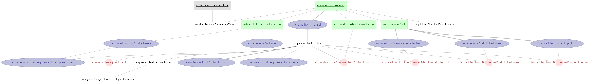

# Inagaki et al., 2018, 2019

Data pipeline for Inagaki et al., 2018, 2019 from Svoboda Lab.

This project presents a DataJoint pipeline design for the data accompanying the papers:
>Hidehiko K. Inagaki, Lorenzo Fontolan, Sandro Romani & Karel Svoboda. "Discrete Attractor Dynamics Underlies Persistent Activity in the Frontal Cortex" (2019) Nature (https://doi.org/10.1038/s41586-019-0919-7)

>Hidehiko K. Inagaki, Miho Inagaki, Sandro Romani and Karel Svoboda. "Low-Dimensional and Monotonic Preparatory Activity in Mouse Anterior Lateral Motor Cortex" (2018) Jneurosci (https://doi.org/10.1523/JNEUROSCI.3152-17.2018)

A ***DataJoint*** data pipeline has been constructed for this study, with the presented data ingested into this pipeline. This notebook demonstrates the queries, processing, and reproduction of several figures from the paper. From the pipeline, export capability to NWB 2.0 format is also available.

## About the data
The dataset comprises of whole-cell recordings, extracellular recordings and spike sorted results of the mouse's ALM during a delay-response task. The behavior data includes detailed description of the trial structure (e.g. trial timing, trial instruction, trial response, etc.) and the timing of the lick events (e.g. lick left, lick right onset). The data also includes detailed information regarding the optogenetic perturbations on a per-trial basis. 

The data in original MATLAB format (.mat) have been ingested into a DataJoint data pipeline presented below.

Data are also exported into NWB 2.0 format. See NWB export code [here](../scripts/datajoint_to_nwb.py)

## Design DataJoint data pipeline 
This repository contains the **Python 3.7** code of the DataJoint data pipeline design for this dataset, as well as scripts for data ingestions and visualization.
 

## Conversion to NWB 2.0
This repository contains the **Python 3.7** code to convert the DataJoint pipeline into NWB 2.0 format (See https://neurodatawithoutborders.github.io/)
Each NWB file represents one recording session. The conversion script can be found [here](scripts/datajoint_to_nwb.py)

## Demonstration of the data pipeline
Data queries and usages are demonstrated in this [Jupyter Notebook](notebooks/Inagaki-2018-examples.ipynb), where several figures from the paper are reproduced. 

